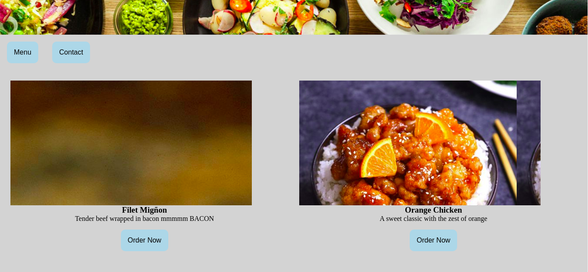

#	PROJECT: Restaurant


> In this project, a static restaurant page was built using Javascript and Webpack.




### 📝 Setup

 - Open a terminal
 
 - Copy this code : 
        ```
        git clone https://github.com/jurgen1c/restaurant-JS.git
        ```

-	npm run dev


### Build With

-	HTML
- JavaScript
- Webpack
-	SASS  

### Check out the live demo [here](https://raw.githack.com/jurgen1c/restaurant-JS/development/dist/index.html)     

## 👤 Authors


👤 **Jurgen Clausen Gutierrez**

- Github: [@jurgen1c](https://github.com/jurgen1c)
- LinkedIn: [jurgen-clausen](https://www.linkedin.com/in/jurgen-clausen-2740061a9/)


## 🤝 Contributing

Contributions, issues and feature requests are welcome!

Feel free to check the [issues page](issues/).

## Show your support

Give a ⭐️ if you like this project!

## Acknowledgments

- Microverse
- etc

## 📝 License

This project is [MIT](lic.url) licensed.
